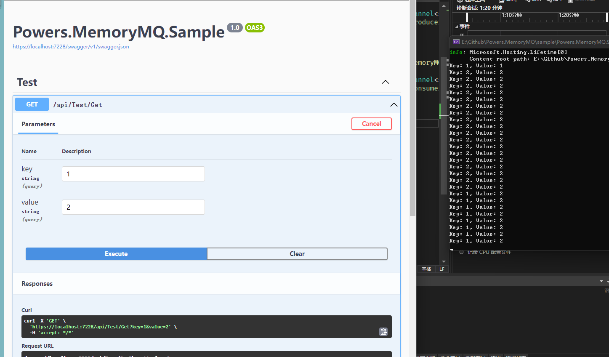

# MemoryMQ

在内存中使用Channel实现的简单队列, 适合一般场景.

### 使用方法(net6)

在`Program.cs`中添加以下代码, 分别用于注册生产者`Producer`和消费者`Consumer`的服务:
```csharp
builder.Services.AddMemoryMQProducer();
builder.Services.AddMemoryMQConsumer();

// 关于消费者, 还需要实现一个后台服务
builder.Services.AddHostedService<MemoryMQService>();
```

消费者实现:
```csharp
[ApiController]
[Route("api/[Controller]/[Action]")]
public class TestController : ControllerBase
{
    private readonly IMessageProducer<string, object> _producer;

    public TestController(IMessageProducer<string, object> producer)
    {
        _producer = producer;
    }

    [HttpGet]
    public async Task<IActionResult> Get(string key, string value)
    {
        // 向MQ中推送消息
        await _producer.ProduceAsync(key, value);

        return NoContent();
    }
}
```

消费者实现:
```csharp
public class MemoryMQService : BackgroundService
{
    private readonly IMessageConsumer<string, object> _consumer;

    public MemoryMQService(IMessageConsumer<string, object> consumer)
    {
        _consumer = consumer;
    }

    protected override Task ExecuteAsync(CancellationToken stoppingToken)
    {
        // 从MQ中消费消息
        _consumer.OnMessage(async (message) =>
        {
            await Task.Run(() =>
            {
                Console.WriteLine($"Key: {message.Item1.ToString()}, Value: {message.Item2.ToString()}");
            });
        });

        return Task.CompletedTask;
    }
}
```

Sample示例:

